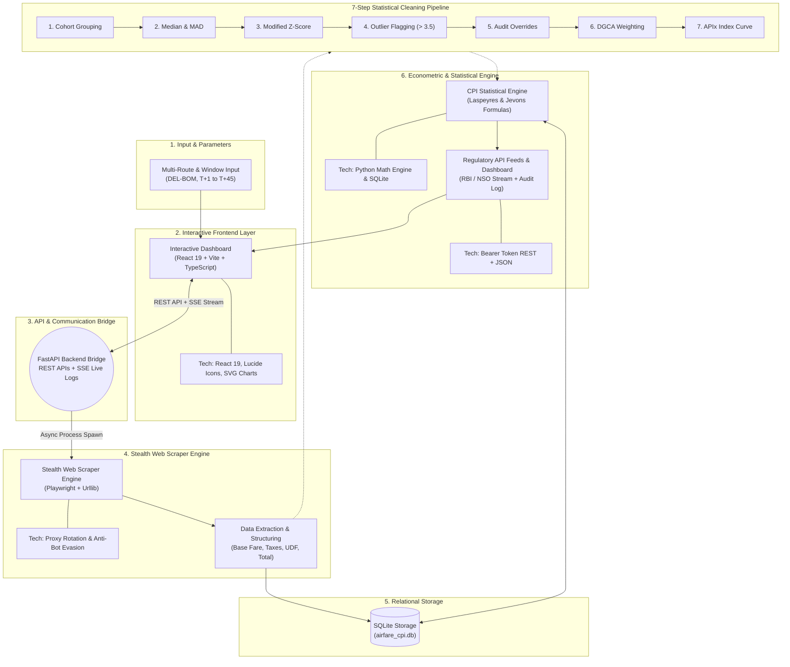

# System Architecture: MoSPI Real-Time Airfare Price Index (RT-APIx)

The **Real-Time Airfare Price Index (RT-APIx)** is an automated econometric computation and data ingestion platform designed to augment India's **Consumer Price Index (CPI)** published by the **Ministry of Statistics and Programme Implementation (MoSPI)** and the **National Statistical Office (NSO)**.

By replacing traditional, manual survey sampling with automated high-frequency web scraping, robust outlier isolation, and Laspeyres/Jevons price index compilation, RT-APIx provides daily real-time inflation indicators for Indian civil aviation.

---

## 1. High-Level Architecture Diagram

The system operates across a coordinated stack spanning an interactive React 19 frontend, an asynchronous FastAPI backend bridge with Server-Sent Events (SSE), an evasive Playwright ingestion engine, SQLite relational persistence, and a 7-step statistical econometric cleaning pipeline.



---

## 2. Six Core Architectural Pillars

```
┌──────────────────────────────────┐  ┌──────────────────────────────────┐
│  1. Data Input & Parameter       │  │  4. Interactive Frontend Layer   │
│     Selection                    │  │     (React 19 + TypeScript)      │
│  • Multi-route selector          │  │  • Executive overview metrics    │
│  • Booking horizons (T+1 to T+45)│  │  • Live SSE crawler stream logs  │
│  • Airline & sector filters      │  │  • Policy configurator & weights │
└─────────────────┬────────────────┘  └─────────────────▲────────────────┘
                  │                                     │
┌─────────────────▼────────────────┐  ┌─────────────────┴────────────────┐
│  2. API & Communication Bridge   │  │  5. Stealth Scraping Engine      │
│     (FastAPI ASGI)               │  │     (Playwright Automation)      │
│  • REST endpoints (/api/*)       │  │  • Headless browser stealth      │
│  • Server-Sent Events (SSE)      │  │  • User-agent randomization      │
│  • Outlier audit overrides       │  │  • Fare breakup decomposition    │
└─────────────────┬────────────────┘  └─────────────────▲────────────────┘
                  │                                     │
┌─────────────────▼────────────────┐  ┌─────────────────┴────────────────┐
│  3. Database & Storage           │  │  6. Statistical Data Cleaning   │
│     (SQLite Relational Store)    │  │     & Econometric Engine         │
│  • flights (raw & cleaned)       │  │  • Median Absolute Deviation(MAD)│
│  • index_history (daily APIx)    │  │  • Modified Z-score (M_i > 3.5)  │
│  • overrides & settings          │  │  • Laspeyres & Jevons formulas   │
└──────────────────────────────────┘  └──────────────────────────────────┘
```

### 1. Data Input & Parameter Selection
- **Targeted Airfare Ingestion:** Collects structured user inputs defining origin-destination city pairs (e.g., `DEL-BOM`, `DEL-BLR`, `BOM-BLR`, `DEL-CCU`, `BLR-HYD`, `MAA-DEL`).
- **Dynamic Booking Windows:** Captures advance booking horizons ($T+1$, $T+7$, $T+15$, $T+30$, $T+45$) to reflect dynamic yield management and load-factor-driven airline pricing.
- **Carrier Demarcation:** Ingests domestic scheduled operators including IndiGo, Air India, Air India Express, Akasa Air, and SpiceJet.

### 2. Interactive Frontend Layer
- **Framework:** Built using **React 19**, **TypeScript**, and **Vite** for sub-millisecond local HMR and high-contrast styling.
- **Visual Intelligence:** Custom SVG trend curves visualizing daily indexed inflation alongside official CPI baselines, Lucide icon indicators, and reactive sector tables.
- **SSE Terminal Console:** Displays real-time streaming logs directly from the backend during live web crawls.
- **Policy Configurator:** Live sliders allowing statistical officers to calibrate DGCA route weights and advance window weights dynamically.

### 3. Stealth Scraping Engine
- **Headless Automation:** Powered by `playwright.sync_api` to execute dynamic DOM evaluation against flight portals.
- **Anti-Bot Countermeasures:** User-Agent header rotation, jittered mouse movements, non-deterministic sleep backoffs, and localized mock-portal failover (`mock_portal.py` running on port 8080).
- **Decomposed Fare Ingestion:** Unbundles prices into `base_fare`, `taxes`, `udf` (User Development Fee), and `convenience_fee` to prevent statutory fee distortions from polluting core tariff calculations.

### 4. API & Communication Bridge
- **Framework:** **FastAPI** running on **Uvicorn** (Port 3001) as an asynchronous ASGI service.
- **Real-Time Log Streaming:** `/api/stream-scraper-logs` provides Server-Sent Events (SSE) streaming live `stdout`/`stderr` from sub-processes to the UI.
- **Governance Endpoints:**
  - `GET /api/index-history`: Chronological daily index series with MoSPI base benchmark (Base = 100).
  - `GET /api/raw-flights`: Complete raw ticket ledger.
  - `GET /api/anomalies`: Flagged statistical outliers pending officer sign-off.
  - `POST /api/override`: Submits manual exclusion or price corrections to the audit ledger.
  - `POST /api/settings`: Updates econometric weighting coefficients and formula modes.

### 5. Database & Relational Storage
- **Engine:** SQLite (`src/data/airfare_cpi.db`) with relational integrity and transactional ACID guarantees.
- **Tables:**
  - `flights`: Primary ticket observations with fare breakdowns, scraping timestamps, and anomaly status (`clean`, `anomaly`, `excluded`, `manual_override`).
  - `index_history`: Compiled daily aggregated index scores, route breakdowns, and baseline reference values.
  - `overrides`: Audit log preserving manual operator decisions, justifications, and timestamps.
  - `settings`: Serialized JSON configuration storing route weights, booking window weights, and index formulation (`laspeyres` / `jevons`).

### 6. Statistical Data Cleaning & Econometric Engine
- **Outlier Filtering:** Replaces standard standard-deviation Z-scores with **Boris Iglewicz and David Hoaglin (1993)** Modified Z-Scores using Median Absolute Deviation (MAD), robust against asymmetric fare surges.
- **Index Formulation:** Executes pure Laspeyres basket aggregation with elementary geometric Jevons aggregations.

---

## 3. The 7-Step Statistical Cleaning Pipeline

To ensure the index conforms to **International Monetary Fund (IMF) Consumer Price Index Manual** standards and MoSPI statutory compliance, data passes through a 7-stage automated pipeline:

```
[ Raw Scraped Tickets ]
         │
         ▼
┌────────────────────────────────────────────────────────┐
│ 1. Cohort Grouping                                     │
│    Partition tickets by Route × Window × Carrier       │
└────────────────────────┬───────────────────────────────┘
                         │
                         ▼
┌────────────────────────────────────────────────────────┐
│ 2. Median & MAD Calculation                            │
│    Compute median (x̃) & MAD = median(|x_i - x̃|)         │
└────────────────────────┬───────────────────────────────┘
                         │
                         ▼
┌────────────────────────────────────────────────────────┐
│ 3. Modified Z-Score Calculation                        │
│    M_i = 0.6745 × (x_i - x̃) / MAD                      │
└────────────────────────┬───────────────────────────────┘
                         │
                         ▼
┌────────────────────────────────────────────────────────┐
│ 4. Outlier Flagging                                    │
│    Isolate flights where |M_i| > 3.5                   │
└────────────────────────┬───────────────────────────────┘
                         │
                         ▼
┌────────────────────────────────────────────────────────┐
│ 5. Audit Overrides                                     │
│    Apply NSO officer approvals or exclusions           │
└────────────────────────┬───────────────────────────────┘
                         │
                         ▼
┌────────────────────────────────────────────────────────┐
│ 6. DGCA Weighting                                      │
│    Apply passenger volume & advance window weights     │
└────────────────────────┬───────────────────────────────┘
                         │
                         ▼
┌────────────────────────────────────────────────────────┐
│ 7. APIx Index Curve Generation                         │
│    Calculate Laspeyres/Jevons Daily Index Series       │
└────────────────────────────────────────────────────────┘
```

### Mathematical Formulations

#### 1. Median Absolute Deviation (MAD)
$$\text{MAD} = \text{median}\left(|x_i - \tilde{x}|\right)$$
*where $\tilde{x} = \text{median}(X)$ for all flight fares within the cohort.*

#### 2. Modified Z-Score ($M_i$)
$$M_i = \frac{0.6745 \cdot (x_i - \tilde{x})}{\text{MAD}}$$
- **Threshold:** If $|M_i| > 3.5$, the observation is flagged as an extreme statistical outlier (surge pricing anomaly, technical glitch, or dynamic pricing shock).
- Flagged fares are excluded from baseline calculations unless confirmed by an authorized NSO audit override.

#### 3. Elementary Price Index (Jevons Geometric Mean)
$$P_{\text{Jevons}} = \left( \prod_{i=1}^{n} p_i \right)^{\frac{1}{n}} = \exp\left( \frac{1}{n} \sum_{i=1}^{n} \ln(p_i) \right)$$

#### 4. Higher-Level Aggregated CPI (Laspeyres Price Index)
$$I_t = \frac{\sum_{r} \sum_{w} W_{r} \cdot W_{w} \cdot \left( \frac{P_{r,w,t}}{P_{r,w,0}} \right)}{\sum_{r} \sum_{w} W_{r} \cdot W_{w}} \times 100$$
*where $W_r$ represents DGCA city-pair passenger volume weight, $W_w$ represents booking window weight, and $P_{r,w,0}$ is the base period price.*

---

## 4. Execution Workflow

1. **Crawler Invocation:** The user triggers a crawl from the React interface or via scheduled cron.
2. **Asynchronous Process Execution:** FastAPI launches `stealth_scraper.py` as a non-blocking child process.
3. **SSE Telemetry:** The child process's `stdout` is intercepted line-by-line and piped to `/api/stream-scraper-logs`.
4. **Data Normalization:** Scraped flights are unbundled and persisted into `flights` with status `pending`.
5. **Pipeline Trigger:** `pipeline.py` executes the 7-step statistical cleaning:
   - Cohorts are evaluated for MAD and Modified Z-scores.
   - Outliers are routed to the anomaly queue.
   - Clean observations are aggregated into weighted Laspeyres index points.
6. **Persistence & Presentation:** Updated index metrics are saved to `index_history`. The React dashboard re-fetches the latest indices and re-renders SVG trends.

---

## 5. Technology Stack Summary

| Layer | Technologies | Role |
|---|---|---|
| **Frontend** | React 19, TypeScript, Vite, Lucide Icons, Vanilla CSS | Interactive Dashboard, Anomaly Hub, Policy Controls |
| **Backend API** | Python 3.10+, FastAPI, Uvicorn, Asyncio | RESTful API Gateway, SSE Event Stream Server |
| **Scraper** | Playwright, Urllib, HTTP Mock Server | Headless Browser Automation, Fare Unbundling |
| **Storage** | SQLite3 (`airfare_cpi.db`) | Persistent Relational Store with ACID Compliance |
| **Statistics** | NumPy / Math Utils, Boris-Iglewicz MAD, Laspeyres | Robust Outlier Rejection & Macroeconomic CPI Indexing |
| **Testing** | Pytest, Oxlint | End-to-end unit, mathematical, and schema testing |
