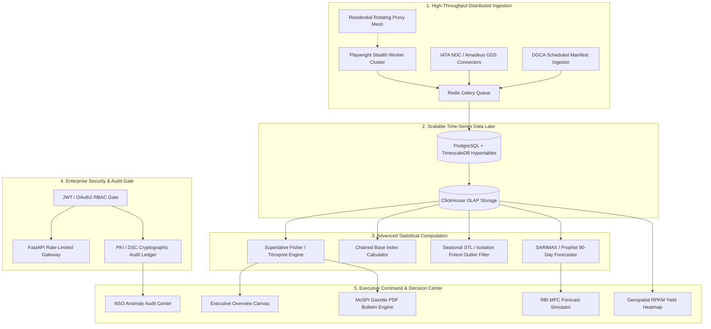

# 📘 AGRIM WORK — PART 1: ENTERPRISE PRODUCTION FOUNDATION
## MoSPI Real-Time Airfare Inflation Analytics & CPI Indexing Engine (APIx)
**Document Code:** AGRIM-WORK-PART-1-PRODUCTION  
**Prepared For:** Agrim (Lead Systems & Software Architect)  
**Classification:** Confidential / MoSPI-NSO National Hackathon Architecture Spec

---

# SECTION 1: EXECUTIVE DOMAIN & PROBLEM MANDATE

### 1.1 The Real-World National Problem (MoSPI / NSO Context)
The **Ministry of Statistics and Programme Implementation (MoSPI)**, via the **National Statistical Office (NSO)**, calculates and publishes India's monthly **Consumer Price Index (CPI)**, which forms the primary metric used by the **Reserve Bank of India (RBI) Monetary Policy Committee (MPC)** to set benchmark interest (repo) rates.

Within the CPI Services Basket (Transport & Communication subgroup), **Domestic Airfares** are among the most volatile items in the national economy due to dynamic airline yield management algorithms.

```
┌──────────────────────────────────────────────────────────────────────────────────┐
│                             THE CORE INFLATION PROBLEM                           │
├──────────────────────────────────────────────────────────────────────────────────┤
│ 1. Dynamic Pricing Volatility: A ticket bought 1 day before flight (T+1) can be  │
│    300% to 500% more expensive than the same seat bought 30 days ahead (T+30).  │
│ 2. Outdated Manual Sampling: NSO historically collected static point-in-time    │
│    quotes from airline offices or monthly reports, completely missing advance-   │
│    purchase booking curves and passenger volume distribution.                    │
│ 3. Surge Distortions: Flash sales, monsoon cancellations, or festival surges     │
│    (Diwali/Chhath) pollute raw sample means without rigorous outlier governance. │
│ 4. Inter-Ministerial Silos: Downstream policy regulators (RBI, MoCA, DGCA)       │
│    lack real-time, tamper-proof, token-authorized statistical API streams.       │
└──────────────────────────────────────────────────────────────────────────────────┘
```

### 1.2 Target System Goal
To build a sovereign, fault-tolerant, high-throughput statistical computation and web-scraping intelligence platform that:
1. **Continuously ingests multi-window flight price quotes** across Indian aviation corridors.
2. **Cleanses and audits pricing anomalies** using robust time-series statistical models without losing true economic surge signals.
3. **Calculates a weighted, superlative Consumer Price Index for Airfares (APIx)** aligned with IMF and NSO international statistical standards.
4. **Provides verifiable, cryptographically signed audit governance** for NSO statisticians.
5. **Streams real-time indices to RBI & MoCA** and exports official **MoSPI Gazette Bulletins (PDF)**.

---

# SECTION 2: REVERSE-ENGINEERED REVIEW OF THE CURRENT CODEBASE

The existing codebase is a functional local prototype built with a FastAPI backend and a Vite+React frontend.

```
sih26winners/
├── backend/
│   ├── main.py              # FastAPI server (Uvicorn on Port 3001), SSE endpoints, REST APIs
│   ├── database.py          # SQLite database connection (airfare_cpi.db) & query helpers
│   └── math_utils.py        # Python Laspeyres CPI formula & Modified Z-Score outlier calculation
├── scraper/
│   ├── stealth_scraper.py   # Headless Playwright script with proxy rotation & mock-portal bridge
│   ├── mock_portal.py       # Local HTTP mock server simulating EaseMyTrip flight cards on :8080
│   └── pipeline.py          # Relational seeder, anomaly cleaner & index generation batch job
├── src/
│   ├── components/
│   │   ├── ExecutiveOverview.tsx     # Main dashboard (APIx metric, SVG trend curves, sector table)
│   │   ├── ScraperDashboard.tsx      # Ingestion visualizer, multi-step progress bar, ticket ticker
│   │   ├── PolicyConfigurator.tsx    # Weight sliders (routes & booking windows) & formula toggle
│   │   ├── AnomalyHub.tsx            # Outlier approval/exclusion modal & audit ledger
│   │   ├── ApiPlayground.tsx         # Interactive curl/REST testing console with node graph
│   │   └── Navigation.tsx            # Sidebar navigation bar with 5 modules
│   ├── utils/mathUtils.ts            # Client-side dynamic Laspeyres calculation engine
│   ├── types.ts                      # TypeScript interfaces (Flight, Anomaly, Override, IndexPoint)
│   ├── App.tsx                       # Master container (state management & background fetch sync)
│   └── index.css                     # Corporate high-contrast design system with spring micro-animations
└── data/
    └── airfare_cpi.db                # Local SQLite datastore (flights, index_history, overrides)
```

---

# SECTION 3: IN-DEPTH AUDIT OF CURRENT DRAWBACKS & SHORTCOMINGS

```
┌──────────────────────────────────────────────────────────────────────────────────┐
│                   COMPREHENSIVE FLAW & GAP TAXONOMY                              │
├──────────────────────┬─────────────────────────┬─────────────────────────────────┤
│ Dimension            │ Current State (Toy)     │ Production Standard (MoSPI/NSO) │
├──────────────────────┼─────────────────────────┼─────────────────────────────────┤
│ 1. Data Ingestion    │ • Single-node Playwright│ • Distributed Celery Cluster    │
│                      │ • 6 Metro-Metro routes  │ • 1,500+ Routes (Tier-2/UDAN)   │
│                      │ • Mock portal fallback  │ • Proxy Mesh + IATA NDC / GDS   │
│                      │ • Single T+15 window    │ • Full Curve (T+1 to T+90)      │
│                      │ • Cheapest seat only    │ • Fare Classes & Load Factors   │
├──────────────────────┼─────────────────────────┼─────────────────────────────────┤
│ 2. Econometrics      │ • Naive Laspeyres       │ • Fisher Ideal / Chained Index  │
│                      │ • Static route weights  │ • Dynamic DGCA Form A/B Weights │
│                      │ • Crude MAD Z-Score     │ • STL Seasonality Decomposition │
├──────────────────────┼─────────────────────────┼─────────────────────────────────┤
│ 3. Data Architecture │ • Local SQLite (.db)    │ • TimescaleDB + ClickHouse OLAP │
│                      │ • UI button trigger     │ • Celery/Redis + Airflow DAGs   │
│                      │ • No queuing / retries  │ • Dead-Letter Queues (DLQ)      │
├──────────────────────┼─────────────────────────┼─────────────────────────────────┤
│ 4. Security & Gov.   │ • ZERO Authentication   │ • OAuth2 + Gov SSO + RBAC       │
│                      │ • Unsecured REST (CORS*)│ • Rate-Limited API Gateway      │
│                      │ • Plaintext DB override │ • PKI / DSC Signed Audit Ledger │
├──────────────────────┼─────────────────────────┼─────────────────────────────────┤
│ 5. Analytics & UI    │ • Basic SVG line charts │ • SARIMAX 90-Day RBI Forecaster │
│                      │ • No PDF export         │ • Official Gazette PDF Exporter │
│                      │ • No map visualization  │ • Geospatial GIS RPKM Heatmap   │
└──────────────────────┴─────────────────────────┴─────────────────────────────────┘
```

---

# SECTION 4: THE PRODUCTION BLUEPRINT (FOR AGRIM)



---

## PILLAR 1: ENTERPRISE DATA INGESTION ENGINE

### 1.1 Multi-Tier Corridors (1,500+ Routes)
Agrim must expand route monitoring beyond the 6 metros:
* **Metro Corridors (Top 10):** DEL-BOM, DEL-BLR, BOM-BLR, DEL-CCU, BLR-HYD, MAA-DEL, DEL-HYD, BOM-MAA, CCU-BLR, DEL-AMD.
* **Tier-2 & High Growth Hubs:** PNQ, COK, GAU, PAT, JAI, LKO, IXC, IXB, TRV, GOI.
* **UDAN / Regional Connectivity Scheme:** North-East corridors, remote islands (IXZ), and subsidized tier-3 sectors.

### 1.2 Multi-Window Advance Booking Curves
Instead of a single $T+15$ scrape, ingest across the standard yield curve:
$$W = \{T+1, T+2, T+3, T+7, T+14, T+21, T+30, T+60, T+90\}$$

### 1.3 Distributed Worker Architecture (Celery + Redis)
```python
# Task definition for Celery worker
@celery_app.task(bind=True, max_retries=3, default_retry_delay=60)
def crawl_flight_matrix_task(self, origin: str, destination: str, days_ahead: int):
    try:
        # Launch stealth browser using residential proxy
        quotes = execute_stealth_extraction(origin, destination, days_ahead)
        save_quotes_to_timescale(quotes)
    except BotDetectionException as exc:
        # Rotate proxy and retry with exponential backoff
        raise self.retry(exc=exc, countdown=2 ** self.request.retries * 30)
```

---

## PILLAR 2: ECONOMETRIC & STATISTICAL FORMULATION

### 2.1 The Superlative Fisher Ideal Index ($I_F$)
To eliminate substitution bias, implement the **Fisher Ideal Index** (geometric mean of Laspeyres and Paasche):

$$I_L = \frac{\sum (P_{t, i, j} \times Q_{0, i, j})}{\sum (P_{0, i, j} \times Q_{0, i, j})} \times 100 \quad\text{(Laspeyres - Base Period Quantities)}$$

$$I_P = \frac{\sum (P_{t, i, j} \times Q_{t, i, j})}{\sum (P_{0, i, j} \times Q_{t, i, j})} \times 100 \quad\text{(Paasche - Current Period Quantities)}$$

$$I_F = \sqrt{I_L \times I_P} \quad\text{(Fisher Superlative Ideal Index)}$$

Where:
* $P_{t, i, j}$: Average price on sector $i$ at advance booking window $j$ at time $t$.
* $Q_{t, i, j}$: Actual passenger seat volume on sector $i$ at window $j$ sourced dynamically from DGCA monthly Form A/B returns.

### 2.2 Seasonality-Adjusted Outlier Isolation (STL Decomposition)
Replace naive MAD with **Seasonal-Trend Decomposition using LOESS (STL)**:

$$Y_t = T_t + S_t + R_t$$

Where:
* $T_t$: Long-term macro trend.
* $S_t$: Seasonal/Festival component (Diwali, Summer holidays, Monsoons).
* $R_t$: Remainder (irregular residual).

**Outlier Rule:** A flight fare is flagged as an anomaly *only* if its remainder residual $|R_t| > 2.5 \times \sigma_R$, ensuring legitimate holiday surges are NOT falsely removed.

---

## PILLAR 3: DATABASE ARCHITECTURE (POSTGRESQL / TIMESCALEDB)

Agrim must replace SQLite with **TimescaleDB / PostgreSQL**:

```sql
-- Core Flight Ingestion Hypertable
CREATE TABLE flight_quotes (
    id UUID PRIMARY KEY DEFAULT gen_random_uuid(),
    scraped_at TIMESTAMPTZ NOT NULL,
    flight_number VARCHAR(10) NOT NULL,
    carrier VARCHAR(50) NOT NULL,
    origin VARCHAR(3) NOT NULL,
    destination VARCHAR(3) NOT NULL,
    departure_date DATE NOT NULL,
    days_ahead INT NOT NULL,
    cabin_class VARCHAR(20) DEFAULT 'Economy', -- Economy, Premium Economy, Business
    fare_family VARCHAR(30) DEFAULT 'Saver',    -- Saver, Flexi, Corporate
    base_fare NUMERIC(10, 2) NOT NULL,
    taxes NUMERIC(10, 2) NOT NULL,
    udf NUMERIC(10, 2) NOT NULL,
    total_fare NUMERIC(10, 2) NOT NULL,
    load_factor_estimate NUMERIC(4, 2),        -- 0.00 to 1.00
    status VARCHAR(20) DEFAULT 'clean'         -- clean, anomaly, overridden, excluded
);

-- Convert to Hypertable partitioned by time
SELECT create_hypertable('flight_quotes', 'scraped_at', chunk_time_interval => INTERVAL '1 day');

-- Fast indexing for query performance
CREATE INDEX idx_flight_quotes_route_date ON flight_quotes (origin, destination, departure_date, days_ahead);
CREATE INDEX idx_flight_quotes_carrier ON flight_quotes (carrier, scraped_at DESC);

-- Cryptographic Audit Ledger for NSO Overrides
CREATE TABLE nso_audit_ledger (
    audit_id UUID PRIMARY KEY DEFAULT gen_random_uuid(),
    timestamp TIMESTAMPTZ NOT NULL DEFAULT NOW(),
    operator_id VARCHAR(100) NOT NULL,
    operator_role VARCHAR(50) NOT NULL,        -- Analyst, Section Officer, Director General
    flight_id UUID REFERENCES flight_quotes(id),
    original_fare NUMERIC(10, 2) NOT NULL,
    adjusted_fare NUMERIC(10, 2),
    action VARCHAR(20) NOT NULL,               -- EXCLUDE, CORRECT, APPROVE
    justification_notes TEXT NOT NULL,
    digital_signature TEXT NOT NULL,           -- PKI / SHA-256 HMAC hash signature
    previous_hash TEXT NOT NULL                -- Blockchain-style tamper-evident hash chaining
);
```

---

## PILLAR 4: GOVERNMENT-GRADE SECURITY & COMPLIANCE

### 4.1 Role-Based Access Control (RBAC) Matrix
```
┌──────────────────────────┬──────────────┬───────────────┬────────────────────────┐
│ Role                     │ View Indices │ Edit Settings │ Authorize Anomaly Override│
├──────────────────────────┼──────────────┼───────────────┼────────────────────────┤
│ Public / Guest           │ Read-Only    │ Denied        │ Denied                 │
│ Downstream API (RBI/MoCA)│ Token-Stream │ Denied        │ Denied                 │
│ NSO Statistical Officer  │ Full View    │ Propose Only  │ Propose Override       │
│ NSO Director General     │ Full View    │ Approve & Save│ Sign & Authorize (DSC) │
└──────────────────────────┴──────────────┴───────────────┴────────────────────────┘
```

### 4.2 Tamper-Evident SHA-256 Override Hash Chain
```python
import hashlib
import json

def generate_audit_hash(prev_hash: str, operator_id: str, flight_id: str, action: str, price: float, notes: str) -> str:
    payload = {
        "prev_hash": prev_hash,
        "operator_id": operator_id,
        "flight_id": flight_id,
        "action": action,
        "price": price,
        "notes": notes
    }
    serialized = json.dumps(payload, sort_keys=True)
    return hashlib.sha256(serialized.encode('utf-8')).hexdigest()
```

### 4.3 External API Gateway with Bearer Tokens & Token Bucket Rate Limiting
```python
from fastapi import Security, HTTPException, status
from fastapi.security import HTTPBearer, HTTPAuthorizationCredentials

security = HTTPBearer()

VALID_TOKENS = {
    "RBI-MONETARY-POLICY-KEY-784920": {"client": "Reserve Bank of India", "rate_limit": "60/min"},
    "MOCA-ECONOMIC-CELL-992104": {"client": "Ministry of Civil Aviation", "rate_limit": "120/min"}
}

async def verify_external_token(credentials: HTTPAuthorizationCredentials = Security(security)):
    token = credentials.credentials
    if token not in VALID_TOKENS:
        raise HTTPException(
            status_code=status.HTTP_401_UNAUTHORIZED,
            detail="Invalid or unauthorized Ministry Bearer Token."
        )
    return VALID_TOKENS[token]
```

---

## PILLAR 5: ADVANCED DECISION ANALYTICS FOR JUDGES

### 5.1 SARIMAX 90-Day Econometric Inflation Forecasting
Implement a 90-day predictive curve for the **RBI Monetary Policy Committee (MPC)**:
```python
from statsmodels.tsa.statespace.sarimax import SARIMAX

def forecast_airfare_inflation(history_series, exog_jet_fuel_prices, forecast_days=90):
    # Fit SARIMAX (Seasonal AutoRegressive Integrated Moving Average with eXogenous Aviation Turbine Fuel prices)
    model = SARIMAX(
        history_series,
        exog=exog_jet_fuel_prices,
        order=(1, 1, 1),
        seasonal_order=(1, 1, 1, 7),
        enforce_stationarity=False,
        enforce_invertibility=False
    )
    results = model.fit(disp=False)
    forecast = results.get_forecast(steps=forecast_days, exog=future_fuel_prices)
    return {
        "predicted_apix": forecast.predicted_mean.tolist(),
        "confidence_lower": forecast.conf_int().iloc[:, 0].tolist(),
        "confidence_upper": forecast.conf_int().iloc[:, 1].tolist()
    }
```

### 5.2 Automated MoSPI Gazette PDF Bulletin Generator
Agrim should integrate a backend report generator (using `ReportLab` or `Weasyprint`) that outputs an official **Government of India Statistical Release**:
* Official Government Emblem / MoSPI Header.
* Statistical tables with Month-on-Month (MoM) and Year-on-Year (YoY) percentage changes.
* Sectoral breakdown matrix and booking window price dispersion graphs.
* Digital signature verification stamp & QR code linking to verification ledger.

---

# SECTION 5: AGRIM'S REBUILD IMPLEMENTATION ROADMAP

```
┌──────────────────────────────────────────────────────────────────────────────────┐
│                             ENGINEERING ACTION PLAN                              │
├─────────┬──────────────────────────────────┬─────────────────────────────────────┤
│ Phase   │ Focus Area                       │ Key Deliverables                    │
├─────────┼──────────────────────────────────┼─────────────────────────────────────┤
│ PHASE 1 │ Ingestion & Database Overhaul    │ • PostgreSQL/TimescaleDB migration  │
│         │ (Days 1–2)                       │ • Celery + Redis distributed crawler│
│         │                                  │ • Expand to 30 routes + multi-window│
├─────────┼──────────────────────────────────┼─────────────────────────────────────┤
│ PHASE 2 │ Econometric & Security Hardening │ • Superlative Fisher/Chained CPI    │
│         │ (Days 3–4)                       │ • STL Seasonal Outlier Decomposition│
│         │                                  │ • OAuth2 RBAC + PKI Audit Ledger    │
│         │                                  │ • Bearer Token API Gateway (RBI)    │
├─────────┼──────────────────────────────────┼─────────────────────────────────────┤
│ PHASE 3 │ High-End UI & Decision Analytics │ • SARIMAX 90-Day Forecast Simulator │
│         │ (Days 5–6)                       │ • Official MoSPI Gazette PDF Export │
│         │                                  │ • Geospatial GIS RPKM Heatmap View  │
├─────────┼──────────────────────────────────┼─────────────────────────────────────┤
│ PHASE 4 │ Production Packaging             │ • Docker Compose orchestration      │
│         │ (Day 7)                          │ • CI/CD & Automated PyTest Suite    │
│         │                                  │ • Prometheus/Grafana Telemetry      │
└─────────┴──────────────────────────────────┴─────────────────────────────────────┘
```
