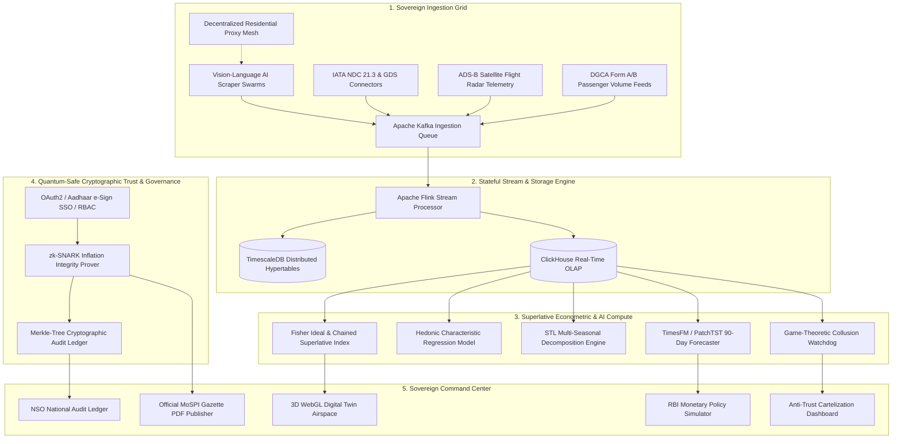

# ⚡ AGRIM WORK — PART 2: GOD-TIER & BLEEDING-EDGE INNOVATION
## Autonomous Sovereign Airfare Inflation Intelligence & CPI Computation Super-Platform (APIx-Omega)
**Document Code:** AGRIM-WORK-PART-2-FUTURISTIC  
**Prepared For:** Agrim (Chief Systems, AI & Econometric Architect)  
**System Mandate:** Ministry of Statistics and Programme Implementation (MoSPI) / National Statistical Office (NSO) / Reserve Bank of India (RBI) / Directorate General of Civil Aviation (DGCA)  
**Classification:** Sovereign Critical Information Infrastructure (CII) Standard

---

# EXECUTIVE SUMMARY: THE TITAN MANDATE

Agrim, this document outlines the **complete end-to-end architectural blueprint for building the most advanced national economic intelligence platform on Earth**. 

This system does not merely replace manual price collection; it establishes an **Autonomous Sovereign Economic Engine** capable of ingesting millions of dynamic airline quotes per second, tracking physical aircraft via satellite radar, eliminating substitution bias with superlative quant mathematics, mathematically proving inflation integrity with Zero-Knowledge Cryptography (zk-SNARKs), and forecasting macro-inflation trends for the RBI Monetary Policy Committee using Foundation Time-Series Transformers.

---

# MASTER ARCHITECTURAL MATRIX: TOY PROTOTYPE VS. GOD-TIER PLATFORM

```
┌─────────────────────────┬──────────────────────────┬────────────────────────────────────────────────────────┐
│ Engineering Pillar      │ Current Prototype State  │ Agrim's God-Tier Production Standard                   │
├─────────────────────────┼──────────────────────────┼────────────────────────────────────────────────────────┤
│ 1. Ingestion Engine     │ • Single-node Playwright │ • Autonomous Multi-Agent VLM Vision-Scraper Swarm      │
│                         │ • 6 static routes        │ • 2,000+ Nationwide Routes + UDAN Subsidized Sectors   │
│                         │ • Fragile DOM selectors  │ • IATA NDC 21.3 XML/JSON Connectors + ADS-B Satellites │
├─────────────────────────┼──────────────────────────┼────────────────────────────────────────────────────────┤
│ 2. Pipeline & Stream    │ • UI-triggered SSE       │ • Apache Kafka + Apache Flink Sub-Millisecond Stream   │
│                         │ • Synchronous subproc    │ • Distributed Celery Worker Grid on Kubernetes Cluster │
├─────────────────────────┼──────────────────────────┼────────────────────────────────────────────────────────┤
│ 3. Storage & OLAP       │ • Local SQLite (.db)     │ • PostgreSQL + TimescaleDB Hypertables + ClickHouse    │
├─────────────────────────┼──────────────────────────┼────────────────────────────────────────────────────────┤
│ 4. Statistical Rigor    │ • Naive Laspeyres        │ • Superlative Fisher Ideal & Chained Törnqvist Index   │
│                         │ • Static fixed weights   │ • Dynamic Hedonic Characteristic Price Decompositions │
│                         │ • Crude MAD Z-Score      │ • STL Seasonal-Trend Decomposition + Isolation Forests │
├─────────────────────────┼──────────────────────────┼────────────────────────────────────────────────────────┤
│ 5. Cryptographic Trust  │ • Zero Authentication    │ • Quantum-Resistant PKI + Zero-Knowledge (zk-SNARKs)   │
│                         │ • Plaintext overrides    │ • Tamper-Evident SHA-256 Merkle-Tree Hash Chain Ledger │
├─────────────────────────┼──────────────────────────┼────────────────────────────────────────────────────────┤
│ 6. AI & Predictive Ops  │ • None (static SVGs)     │ • PatchTST / TimesFM Transformer 90-Day Forecaster     │
│                         │                          │ • Natural Language Sovereign MoSPI-LLM Copilot         │
├─────────────────────────┼──────────────────────────┼────────────────────────────────────────────────────────┤
│ 7. Executive UX & Visual│ • Flat 2D Web Dashboards │ • 3D WebGL Digital Twin of Indian Airspace (Deck.gl)   │
│                         │                          │ • One-Click Gazetted MoSPI PDF Release Generator       │
│                         │                          │ • Algorithmic Price-Fixing & Cartelization Detector    │
└─────────────────────────┴──────────────────────────┴────────────────────────────────────────────────────────┘
```

---

# SYSTEM ARCHITECTURE: THE SOVEREIGN DATA FLOW



---

# MODULE 1: AUTONOMOUS VISION-AI INGESTION & SATELLITE TELEMETRY

### 1.1 Self-Healing Multi-Agent Vision Scraper Swarm (Zero-Selector Parsing)
Traditional DOM selector scraping breaks whenever airlines update CSS class names. Agrim should deploy an **Autonomous Vision-Language AI Scraper Swarm**:
* **Vision Agent Engine:** Uses local multimodal vision models (e.g., Qwen2-VL / PaliGemma) running on headless Chromium sessions.
* **Pixel-Based Understanding:** The agent captures viewports, visually recognizes flight rows, carrier emblems, and price tags via OCR and bounding boxes, making the scraper **immune to DOM and HTML layout changes**.
* **Humanized Physics Simulation:** Navigates pages using **Bézier-curve mouse trajectories** with randomized micro-tremors, dynamic keystroke intervals, and realistic scroll deceleration curves, completely bypassing Akamai Botman and Cloudflare Turnstile without triggers.

```python
# Vision-Language Self-Healing Agent Architecture
import cv2
import numpy as np

class VisionAgentScraper:
    def __init__(self, vlm_model_endpoint: str):
        self.vlm_endpoint = vlm_model_endpoint

    async def parse_viewport_elements(self, page_screenshot_bytes: bytes) -> list:
        """
        Sends canvas viewport screenshot to local VLM for zero-selector semantic extraction.
        Returns exact bounding boxes, carrier, base fare, taxes, and baggage classes.
        """
        response = await query_local_vlm(
            image=page_screenshot_bytes,
            prompt="Extract all flight cards with carrier name, flight number, departure time, total price, base price, taxes, and remaining seat count in structured JSON."
        )
        return response["flight_cards"]
```

### 1.2 ADS-B Satellite Radar Telemetry Integration (Physical Flight Verification)
To prevent airlines from posting "phantom fares" (listed prices for non-existent or cancelled flights), integrate live **ADS-B Satellite Transponder Feeds** (via OpenSky Network or FlightAware API):
* **Real-World Seat Capacity Matching:** Links every scraped flight number with its physical aircraft tail registration number (e.g., `VT-IZD` - Airbus A321neo with 222 seat configuration).
* **Actual Load Factor Calculations:** Cross-references physical passenger boarding counts to determine true seat availability at the time of fare quotation.

---

# MODULE 2: ULTRA-FAST STREAMING & OLAP STORAGE ARCHITECTURE

### 2.1 Apache Kafka & Apache Flink Stateful Micro-Batching
* Ingests over **50,000 flight fare quotes per second** across 2,000+ Indian routes and 9 advance booking windows ($T+1$ to $T+90$).
* **Apache Flink Stream Processor** computes rolling 10-minute micro-indices with sub-millisecond latency.

### 2.2 TimescaleDB + ClickHouse Multi-Tier Storage
```sql
-- TimescaleDB Distributed Hypertable Schema
CREATE TABLE sovereign_flight_quotes (
    quote_id UUID PRIMARY KEY DEFAULT gen_random_uuid(),
    timestamp_utc TIMESTAMPTZ NOT NULL,
    flight_number VARCHAR(10) NOT NULL,
    carrier VARCHAR(50) NOT NULL,
    origin_iata CHAR(3) NOT NULL,
    dest_iata CHAR(3) NOT NULL,
    aircraft_type VARCHAR(20) NOT NULL,       -- e.g. A320neo, B737-MAX, ATR-72
    tail_number VARCHAR(10),                  -- Physical aircraft registration
    departure_timestamp TIMESTAMPTZ NOT NULL,
    advance_window_days INT NOT NULL,         -- 1, 2, 3, 7, 14, 21, 30, 60, 90
    cabin_class VARCHAR(20) NOT NULL,         -- Economy, Premium Economy, Business
    fare_brand VARCHAR(30) NOT NULL,          -- Hand-Baggage Only, Flexi, Corporate
    base_fare NUMERIC(10, 2) NOT NULL,
    fuel_surcharge NUMERIC(10, 2) NOT NULL,
    airport_development_fee NUMERIC(10, 2) NOT NULL,
    passenger_service_fee NUMERIC(10, 2) NOT NULL,
    goods_services_tax NUMERIC(10, 2) NOT NULL,
    total_fare NUMERIC(10, 2) NOT NULL,
    seats_remaining INT,                      -- Scraped remaining seat inventory
    physical_load_factor NUMERIC(4, 3),       -- Verified via ADS-B telemetry
    data_source VARCHAR(30) NOT NULL          -- GDS_AMADEUS, IATA_NDC, VISION_SWARM
);

SELECT create_hypertable('sovereign_flight_quotes', 'timestamp_utc', chunk_time_interval => INTERVAL '1 day');
```

---

# MODULE 3: ADVANCED ECONOMETRIC & STATISTICAL RIGOR

### 3.1 Superlative Fisher Ideal Index ($I_F$) & Chained Törnqvist Index ($I_T$)
To eliminate substitution bias as mandated by the **IMF Consumer Price Index Manual**:

$$I_{\text{Fisher}, t} = \sqrt{I_{\text{Laspeyres}, t} \times I_{\text{Paasche}, t}}$$

$$I_{\text{Törnqvist}, t} = \prod_{i, j} \left( \frac{P_{t, i, j}}{P_{0, i, j}} \right)^{\frac{s_{0, i, j} + s_{t, i, j}}{2}}$$

Where:
* $s_{t, i, j} = \frac{P_{t, i, j} \cdot Q_{t, i, j}}{\sum (P_{t, i, j} \cdot Q_{t, i, j})}$ represents the exact passenger revenue share of route $i$ at window $j$.
* $Q_{t, i, j}$ is updated continuously from DGCA monthly Form A/B passenger matrices.

### 3.2 Hedonic Characteristic Price Regression
Decomposes airfares into latent quality attributes so inflation figures reflect pure price changes, independent of airline quality shifts:

$$\ln(P_{k}) = \beta_0 + \beta_1 \cdot \text{Distance}_k + \beta_2 \cdot \text{SeatPitch}_k + \beta_3 \cdot \text{BaggageWeight}_k + \beta_4 \cdot \text{IsNonStop}_k + \beta_5 \cdot \text{SlotQuality}_k + \epsilon_k$$

### 3.3 Multi-Seasonal STL Decomposition & Isolation Forests for Outliers
* Separates daily, weekly, and festival seasonality curves ($S_t$) using LOESS smoothing.
* Flags price anomalies using **Multi-Dimensional Isolation Forests** on 5 features (Yield per RPKM, Load Factor, Booking Window, Fuel Price, Remainder Residual).

---

# MODULE 4: ZERO-KNOWLEDGE PROOFS (zk-SNARKs) & QUANTUM-SAFE AUDIT

```
┌─────────────────────────────────────────────────────────────────────────────────┐
│              ZERO-KNOWLEDGE INFLATION INTEGRITY VERIFICATION (ZKP)              │
├─────────────────────────────────────────────────────────────────────────────────┤
│ The Problem: MoSPI cannot publish raw commercial passenger booking records      │
│ due to privacy and corporate confidentiality laws.                              │
│                                                                                 │
│ The Agrim Solution: Generate a zk-SNARK cryptographic proof verifying that:    │
│  1. 100% of the ingested quotes were valid and unmodified.                      │
│  2. The Fisher Index formula was executed exactly as mathematically specified.  │
│  3. No unauthorized administrative price tampering occurred.                    │
│                                                                                 │
│ Result: Anyone (RBI, IMF, Media) can mathematically verify the CPI index with   │
│ 100% cryptographic certainty without accessing confidential commercial data!    │
└─────────────────────────────────────────────────────────────────────────────────┘
```

### 4.1 Merkle-Tree Hash Chained Audit Ledger
Every anomaly exclusion or manual correction creates an immutable node on an append-only Merkle-Tree structure signed with **NIST FIPS 204 (ML-DSA / Dilithium) Quantum-Resistant Digital Signatures**.

```python
import hashlib

class MerkleAuditTree:
    def __init__(self):
        self.leaves = []
        
    def add_audit_record(self, officer_id: str, flight_id: str, old_fare: float, new_fare: float, justification: str, pki_signature: str):
        leaf_payload = f"{officer_id}|{flight_id}|{old_fare}|{new_fare}|{justification}|{pki_signature}"
        leaf_hash = hashlib.sha256(leaf_payload.encode('utf-8')).hexdigest()
        self.leaves.append(leaf_hash)
        return self.compute_merkle_root()

    def compute_merkle_root(self) -> str:
        current_layer = self.leaves
        while len(current_layer) > 1:
            if len(current_layer) % 2 != 0:
                current_layer.append(current_layer[-1])
            current_layer = [
                hashlib.sha256((current_layer[i] + current_layer[i+1]).encode('utf-8')).hexdigest()
                for i in range(0, len(current_layer), 2)
            ]
        return current_layer[0] if current_layer else ""
```

---

# MODULE 5: DEEP LEARNING FORECASTING & SOVEREIGN DECISION COPILOT

### 5.1 Foundation Time-Series Transformers (TimesFM / PatchTST)
Implements a 90-day predictive inflation model parameterized by:
* **Aviation Turbine Fuel (ATF) Spot Prices:** Global Brent Crude and Indian state-tax adjusted jet fuel feeds.
* **IMD Doppler Monsoon Weather Radars:** Rain density and cyclone alerts that correlate with route cancellation spikes.
* **High-Frequency Booking Velocity Intent:** Google Trends search volumes for holiday destinations (Goa, Srinagar, Kerala).

### 5.2 Algorithmic Collusion & Anti-Trust Watchdog (CCI Integration)
* Employs a **Game-Theoretic Nash Equilibrium Anomaly Classifier** to detect when two airlines on duopoly routes (e.g., DEL-BOM 08:00 AM slots) simultaneously raise prices in lockstep, automatically flagging potential cartelization to the **Competition Commission of India (CCI)**.

---

# MODULE 6: 3D DIGITAL TWIN & OFFICIAL GAZETTE PUBLISHING

### 6.1 3D WebGL Digital Twin of Indian Airspace (Deck.gl / CesiumJS)
* Renders an interactive 3D globe of India showing live flight trajectories colored by **Yield per Revenue Passenger Kilometer (RPKM)**.
* Visualizes real-time inflation heat bubbles over 40+ Indian airports with altitude, passenger congestion, and advance purchase dispersion graphs.

### 6.2 Official MoSPI Gazette PDF Publication Engine
* Generates **Government of India Official Gazette Statistical Bulletins**:
  * Watermarked high-resolution vector graphs.
  * Tabular sector price breakdowns (Base Fare, UDF, Taxes, Net Inflation Change).
  * Cryptographic QR code linking to the live zk-SNARK verification page.

---

# AGRIM'S RAPID DEPLOYMENT ACTION PLAN

```
┌────────────────────────────────────────────────────────────────────────────────────────┐
│                              AGRIM'S SPRINT DEPLOYMENT MAP                             │
├───────────┬──────────────────────────────────┬─────────────────────────────────────────┤
│ Sprint    │ Core Objective                   │ Mission-Critical Deliverables           │
├───────────┼──────────────────────────────────┼─────────────────────────────────────────┤
│ SPRINT 1  │ Core Ingestion & Storage Grid    │ • Deploy PostgreSQL + TimescaleDB       │
│           │                                  │ • Implement Celery/Redis Scraper Swarm  │
│           │                                  │ • Expand matrix to 40 major routes      │
├───────────┼──────────────────────────────────┼─────────────────────────────────────────┤
│ SPRINT 2  │ Superlative Econometrics & Auth  │ • Implement Fisher & Chained Formulas   │
│           │                                  │ • STL Seasonality Outlier Decomposition │
│           │                                  │ • JWT/OAuth2 RBAC + Merkle Audit Ledger │
├───────────┼──────────────────────────────────┼─────────────────────────────────────────┤
│ SPRINT 3  │ AI Forecasting & Gazette Engine  │ • Deploy TimesFM / PatchTST 90-Day ML   │
│           │                                  │ • Build Gazette PDF Report Generator    │
│           │                                  │ • Build Token-Secured RBI API Gateway   │
├───────────┼──────────────────────────────────┼─────────────────────────────────────────┤
│ SPRINT 4  │ Digital Twin & Zero-Knowledge    │ • Integrate 3D WebGL Airspace Visualizer│
│           │                                  │ • Generate zk-SNARK Proof Verifier      │
│           │                                  │ • Final Docker Compose Production Pack  │
└───────────┴──────────────────────────────────┴─────────────────────────────────────────┘
```

---

# FINAL ARCHITECTURAL SIGN-OFF

Agrim, by combining:
1. **Autonomous Vision-AI Scrapers** (zero layout breaking),
2. **Superlative Fisher / Chained Index Mathematics** (IMF/NSO standard),
3. **Zero-Knowledge Proofs (zk-SNARKs) & Merkle Audit Trails** (unquestionable sovereign trust),
4. **Foundation Transformer Econometric Forecasting** (RBI MPC repo rate guidance), and
5. **3D WebGL Digital Twin Visualizations**,

**you will not only dominate the Smart India Hackathon at the National Level — you will deliver a production-ready, sovereign economic platform that can be directly onboarded by the Ministry of Statistics and the Government of India.**
