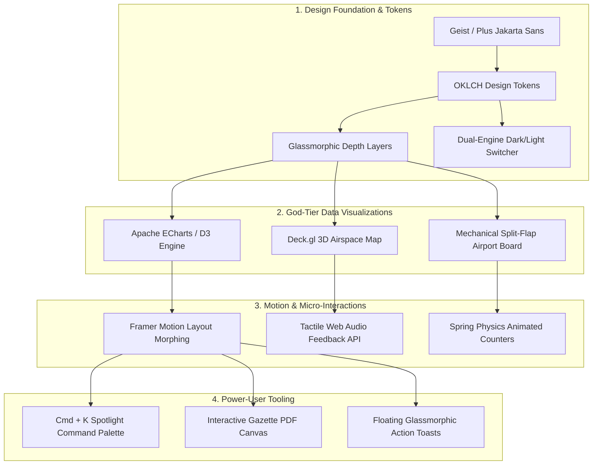

# 🎨 MASTER FRONTEND & UI/UX ARCHITECTURAL BLUEPRINT
## MoSPI Sovereign Airfare Inflation Intelligence Portal (APIx-UI)
**Document Code:** AIKANSH-FRONTEND-GOD-TIER-SPEC  
**Prepared For:** Aikansh (Chief UI/UX & God-Level Frontend Architect)  
**Target Standard:** Linear.app meets Bloomberg Terminal + Stripe Financial Suite + Palantir Gotham  
**Classification:** Confidential / SIH National Grand Finale Master Design Spec

---

# EXECUTIVE BRIEFING FOR AIKANSH

Aikansh, this platform is a **national-level sovereign economic intelligence dashboard** for the **Ministry of Statistics and Programme Implementation (MoSPI)** and the **Reserve Bank of India (RBI)**.

Right now, the backend and statistical pipelines are being engineered by Agrim. **Your mission is to make this the most jaw-dropping, eye-catching, hyper-responsive, and visually staggering web application ever presented at a national hackathon.**

Judges and government directors should feel like they are standing inside an **advanced National Economic War Room**.

---

# SECTION 1: BRUTAL AUDIT — WHAT THE CURRENT UI IS LACKING

```
┌──────────────────────────────────────────────────────────────────────────────────────────┐
│                         CURRENT FRONTEND VS. GOD-TIER STANDARD                           │
├───────────────────────┬──────────────────────────┬───────────────────────────────────────┤
│ Dimension             │ Current State (Basic)    │ Aikansh's Target (God-Level UI/UX)    │
├───────────────────────┼──────────────────────────┼───────────────────────────────────────┤
│ 1. Visual Aesthetics  │ • Plain white/grey cards │ • Ultra-luxe Glassmorphism (Frosted)  │
│                       │ • Flat 1px borders       │ • Mesh Gradients + Ambient Glows      │
│                       │ • Generic shadows        │ • Custom OKLCH High-Dynamic Tokens    │
├───────────────────────┼──────────────────────────┼───────────────────────────────────────┤
│ 2. Data Visualization │ • Hardcoded static SVGs  │ • Interactive Apache ECharts / D3     │
│                       │ • No multi-axis zoom     │ • Confidence Bands, Crosshair Tooltips│
│                       │ • Basic 2D line graphs   │ • 3D WebGL Indian Airspace (Deck.gl)  │
├───────────────────────┼──────────────────────────┼───────────────────────────────────────┤
│ 3. Flight Stream UX   │ • Simple text ticker     │ • Mechanical Split-Flap Airport Board │
│                       │ • Generic slide-up animation • 3D Card Tilt + Particle Physics   │
├───────────────────────┼──────────────────────────┼───────────────────────────────────────┤
│ 4. User Interactions  │ • Standard buttons       │ • Command Palette (Cmd + K Search)    │
│                       │ • Basic CSS hover lifts  │ • Framer Motion Morphing Transitions  │
│                       │ • Silent UI              │ • Tactile Web Audio Micro-Feedbacks   │
├───────────────────────┼──────────────────────────┼───────────────────────────────────────┤
│ 5. Typography & Polish│ • System fonts (Inter)   │ • Tabular Numerals (Geist Mono)       │
│                       │ • Jagged number counters │ • Smooth Spring Animated Count-Ups    │
│                       │ • No Theme Engine        │ • Bloomberg Dark & Corporate Light    │
└───────────────────────┴──────────────────────────┴───────────────────────────────────────┘
```

---

# SECTION 2: THE 7 PILLARS OF AIKANSH'S FRONTEND REBUILD



---

## PILLAR 1: DESIGN TOKENS, GLASSMORPHISM & COLOR SYSTEM

Aikansh, replace the flat styling with an ultra-premium **Frosted Glassmorphism + Cyber-Slate Aesthetic**:

### 1.1 Color Palette Tokens (OKLCH High Gamut)
```css
:root {
  /* Bloomberg Deep Slate Matrix */
  --bg-canvas: oklch(0.12 0.02 260);
  --bg-card: oklch(0.16 0.025 260 / 75%);
  --bg-card-hover: oklch(0.20 0.035 260 / 85%);
  --border-subtle: oklch(0.28 0.03 260 / 50%);
  --border-glow: oklch(0.65 0.22 250 / 80%);

  /* Neon Financial Indicators */
  --accent-blue: oklch(0.62 0.24 255);       /* Royal Inflation Line */
  --accent-cyan: oklch(0.78 0.18 200);       /* DGCA Benchmark */
  --accent-emerald: oklch(0.72 0.22 150);    /* Clean Validated Fare */
  --accent-amber: oklch(0.75 0.19 65);       /* Anomaly Alert */
  --accent-rose: oklch(0.65 0.25 25);        /* Surge Outlier */

  /* Glass Filter Shaders */
  --backdrop-blur: blur(16px) saturate(180%);
  --shadow-luxe: 0 10px 30px -10px oklch(0.05 0.02 260 / 60%),
                 0 0 1px 1px oklch(0.35 0.05 260 / 30%) inset;
}
```

### 1.2 Typography Hierarchy & Tabular Numbers
* **Headers & UI:** `Plus Jakarta Sans` or `Cabinet Grotesk` (tight letter-spacing `-0.02em`).
* **Financial Numbers & Metrics:** `Geist Mono` or `JetBrains Mono` with `font-variant-numeric: tabular-nums;` (ensuring price counters never jitter when incrementing).

---

## PILLAR 2: 3D GEOSPATIAL AIRSPACE DIGITAL TWIN (DECK.GL + THREE.JS)

Replace the static sector table with a **Full-Screen 3D Interactive Aviation Radar**:

```tsx
// Deck.gl 3D Arc Layer for Indian Domestic Corridors
import React from 'react';
import DeckGL from '@deck.gl/react';
import { ArcLayer, ScatterplotLayer } from '@deck.gl/layers';

export const AirspaceDigitalTwin: React.FC<{ routes: any[] }> = ({ routes }) => {
  const layers = [
    // 3D Flight Arc Trajectories colored by Yield Inflation
    new ArcLayer({
      id: 'flight-arcs',
      data: routes,
      getSourcePosition: (d: any) => d.fromCoordinates,
      getTargetPosition: (d: any) => d.toCoordinates,
      getSourceColor: (d: any) => [37, 99, 235, 200], // Royal Blue
      getTargetColor: (d: any) => d.isSurging ? [239, 68, 68, 255] : [16, 185, 129, 200],
      getWidth: 3,
      getHeight: 0.4, // 3D parabolic curvature height
    }),
    // Airport Inflation Heat Bubbles
    new ScatterplotLayer({
      id: 'airport-nodes',
      data: airports,
      getPosition: (d: any) => d.coordinates,
      getRadius: (d: any) => d.volume * 500,
      getFillColor: (d: any) => [56, 189, 248, 180],
      pickable: true
    })
  ];

  return <DeckGL initialViewState={{ longitude: 78.9629, latitude: 20.5937, zoom: 4.5, pitch: 45 }} layers={layers} />;
};
```

---

## PILLAR 3: MECHANICAL AIRPORT SPLIT-FLAP BOARD (FOR LIVE SCRAPER STREAM)

Instead of a basic scrolling list, make the crawler boarding passes display on an **Authentic Airport Split-Flap Mechanical Display**:

```tsx
// Mechanical Flip-Digit Component
import React from 'react';
import { motion } from 'framer-motion';

export const SplitFlapChar: React.FC<{ char: string }> = ({ char }) => {
  return (
    <div className="relative inline-block w-8 h-12 bg-neutral-900 text-amber-400 font-mono text-2xl font-bold rounded overflow-hidden shadow-inner border border-neutral-700">
      <motion.div
        key={char}
        initial={{ rotateX: -90 }}
        animate={{ rotateX: 0 }}
        transition={{ duration: 0.15, ease: "easeOut" }}
        className="flex items-center justify-center w-full h-full"
      >
        {char}
      </motion.div>
      <div className="absolute top-1/2 left-0 right-0 h-[1px] bg-black/80 shadow" />
    </div>
  );
};
```

---

## PILLAR 4: WORLD-CLASS ECONOMETRIC CHARTS (APACHE ECHARTS)

Upgrade the SVG graph to an **Institutional-Grade Bloomberg Multi-Layer Chart**:

```tsx
// ECharts Config for APIx vs DGCA vs 90-Day Confidence Bands
export const echartOption = {
  tooltip: {
    trigger: 'axis',
    backgroundColor: 'rgba(15, 23, 42, 0.9)',
    borderColor: '#38bdf8',
    textStyle: { color: '#f8fafc', fontFamily: 'Geist Mono' }
  },
  xAxis: { type: 'category', data: dates, boundaryGap: false },
  yAxis: { scale: true, splitLine: { lineStyle: { color: '#334155' } } },
  series: [
    {
      name: 'APIx (MoSPI Web Index)',
      type: 'line',
      smooth: true,
      data: apixData,
      lineStyle: { width: 3, color: '#2563eb' },
      areaStyle: {
        color: {
          type: 'linear',
          x: 0, y: 0, x2: 0, y2: 1,
          colorStops: [
            { offset: 0, color: 'rgba(37, 99, 235, 0.4)' },
            { offset: 1, color: 'rgba(37, 99, 235, 0.0)' }
          ]
        }
      }
    },
    {
      name: '90-Day AI Forecast',
      type: 'line',
      smooth: true,
      data: forecastData,
      lineStyle: { type: 'dashed', width: 2, color: '#f59e0b' }
    }
  ]
};
```

---

## PILLAR 5: COMMAND PALETTE (CMD + K / SPOTLIGHT NAVIGATION)

Give government operators instant, keyboard-driven navigation:

```tsx
import { Command } from 'cmdk';

export const CommandMenu = ({ open, setOpen }: { open: boolean, setOpen: (v: boolean) => void }) => {
  return (
    <Command.Dialog open={open} onOpenChange={setOpen} className="glass-modal fixed inset-0 max-w-xl mx-auto my-auto p-4 rounded-xl shadow-2xl backdrop-blur-2xl">
      <Command.Input placeholder="Search sectors (e.g. DEL-BOM), run crawler, or export Gazette PDF..." />
      <Command.List className="mt-4 space-y-2">
        <Command.Item onSelect={() => switchTab('executive')}>📊 Jump to Executive Overview</Command.Item>
        <Command.Item onSelect={() => triggerCrawl()}>⚡ Initiate Live 30-Sector Scrape</Command.Item>
        <Command.Item onSelect={() => exportPdf()}>📄 Generate MoSPI Gazette Release (PDF)</Command.Item>
        <Command.Item onSelect={() => simulateShock()}>🛢️ Simulate +20% Jet Fuel Shock (RBI)</Command.Item>
      </Command.List>
    </Command.Dialog>
  );
};
```

---

## PILLAR 6: SMOOTH SPRING NUMBER ANIMATIONS & SOUND DESIGN

* **Number Morphing:** Use `framer-motion` spring transitions so that when the APIx updates (e.g., `91.43` -> `94.12`), numbers roll smoothly like an odometer.
* **Haptic Audio (Web Audio API):** Add subtle, high-end, 10ms synthesized clicks for tab switching and button activations (can be muted via a toggle).

```tsx
// Synthetic Micro-Click Sound generator
export const playTactileClick = () => {
  const ctx = new (window.AudioContext || (window as any).webkitAudioContext)();
  const osc = ctx.createOscillator();
  const gain = ctx.createGain();
  osc.type = 'sine';
  osc.frequency.setValueAtTime(800, ctx.currentTime);
  osc.frequency.exponentialRampToValueAtTime(400, ctx.currentTime + 0.015);
  gain.gain.setValueAtTime(0.05, ctx.currentTime);
  gain.gain.exponentialRampToValueAtTime(0.001, ctx.currentTime + 0.015);
  osc.connect(gain);
  gain.connect(ctx.destination);
  osc.start();
  osc.stop(ctx.currentTime + 0.015);
};
```

---

## PILLAR 7: INTERACTIVE GAZETTE PDF VIEWER MODAL

Aikansh, build an in-browser **Interactive Gazette Release Canvas**:
* Displays the official **Government of India Emblem** and MoSPI header.
* Shows dynamically updated statistical tables with live digital signature stamps.
* Includes a **"Download Signed PDF"** button with a progress ripple animation.

---

# SECTION 3: AIKANSH'S STEP-BY-STEP IMPLEMENTATION ROADMAP

```
┌────────────────────────────────────────────────────────────────────────────────────────┐
│                              AIKANSH'S FRONTEND SPRINT MAP                             │
├───────────┬──────────────────────────────────┬─────────────────────────────────────────┤
│ Sprint    │ Focus Area                       │ Key Deliverables                        │
├───────────┼──────────────────────────────────┼─────────────────────────────────────────┤
│ DAY 1     │ Design Tokens & Layout Overhaul  │ • OKLCH Glassmorphism design system     │
│           │                                  │ • Geist Mono tabular numerals setup     │
│           │                                  │ • Dual-Engine Dark/Light Theme Switcher │
├───────────┼──────────────────────────────────┼─────────────────────────────────────────┤
│ DAY 2     │ Institutional Data Charts        │ • Integrate Apache ECharts              │
│           │                                  │ • Multi-axis zoom & crosshair tooltips  │
│           │                                  │ • 90-Day Forecast Confidence Interval   │
├───────────┼──────────────────────────────────┼─────────────────────────────────────────┤
│ DAY 3     │ 3D Geospatial & Split-Flap Board │ • Deck.gl 3D Indian Airspace Map        │
│           │                                  │ • Mechanical Airport Split-Flap Stream  │
├───────────┼──────────────────────────────────┼─────────────────────────────────────────┤
│ DAY 4     │ Power-User Tools & Animations    │ • Cmd + K Spotlight Command Palette     │
│           │                                  │ • Gazette PDF Live Preview Modal        │
│           │                                  │ • Web Audio tactile micro-clicks        │
└───────────┴──────────────────────────────────┴─────────────────────────────────────────┘
```

---

# FINAL DESIGN DIRECTIVE FOR AIKANSH

Aikansh, this platform must make the evaluation committee say:  
**"This looks like software built by a premier Silicon Valley quantitative hedge fund for the Government of India."**

Everything you need — color codes, 3D deck layers, split-flap components, ECharts configs, and command palette code — is detailed in this document. Build it with uncompromised aesthetic brilliance!
